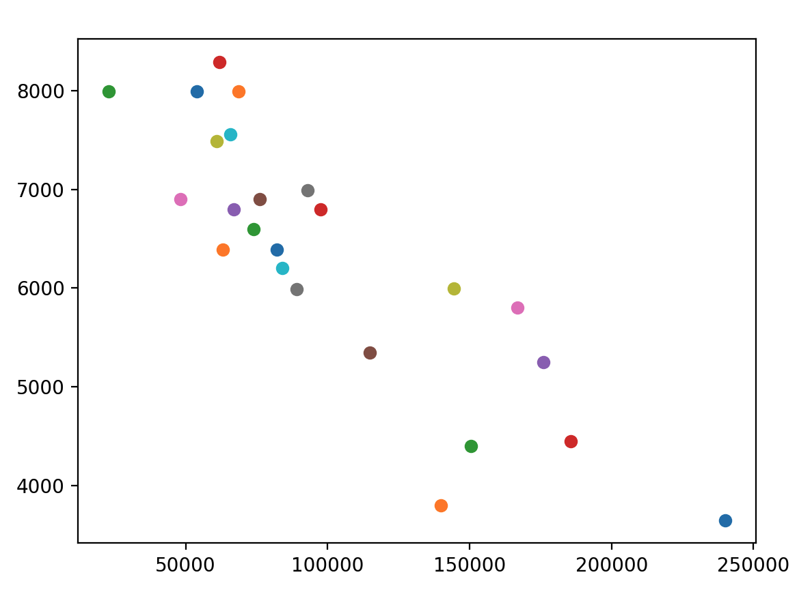
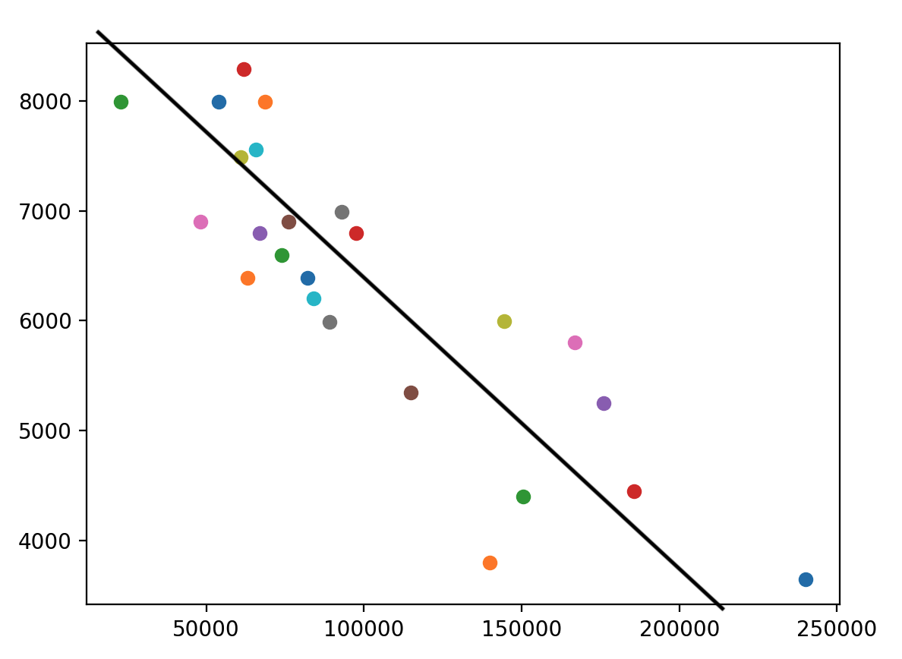
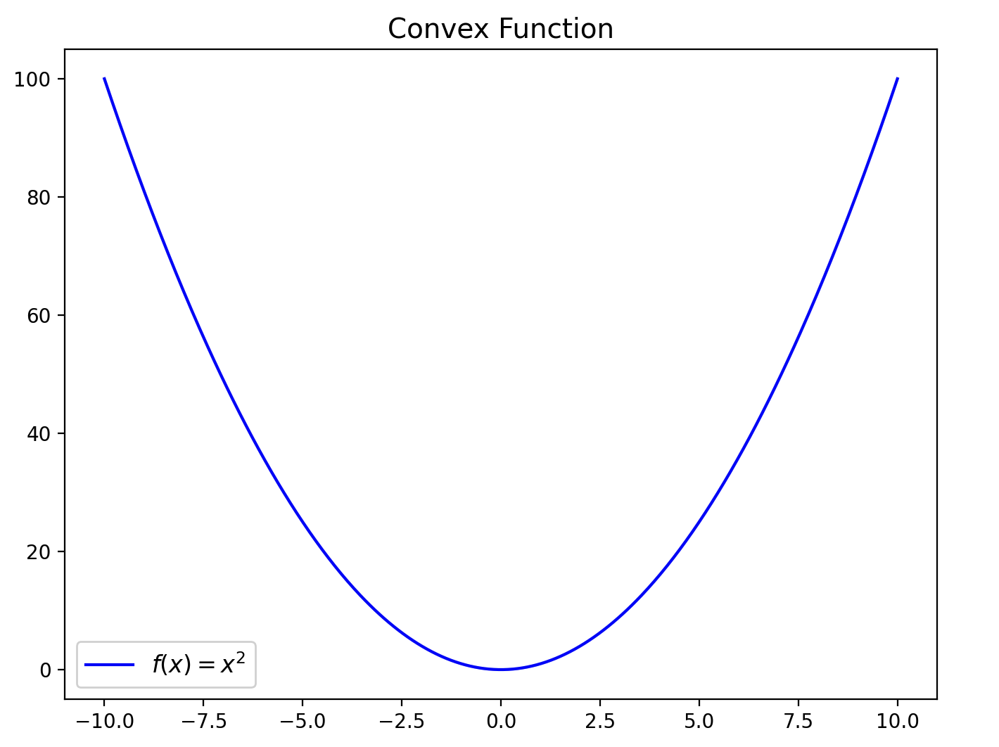

# ft_linear_regression
This project is from 42 school.  
This is the introduction to machine learning with the concept of [linear regression](https://en.wikipedia.org/wiki/Linear_regression) using the [gradient descent](https://en.wikipedia.org/wiki/Gradient_descent) algorithm.  

The objective of this is to create a program that will be able to predict the price of a car based on its age (in km).  
The program will be trained using a provided dataset.  

> [!INFO]
> Every mathematical notion is written using [LaTeX](https://fr.wikipedia.org/wiki/LaTeX)(sound=lateC, to avoid bad jokes)

## Theorical
To create this program we need to create a fonction that based on the dataset will calculate the best average price based on the car age.  

<table>
    <tr>
        <td>
            
If we represent the dataset it's something like this :

            
        </td>
        <td>
            
And we want to obtain something like this :

            
        </td>
    </tr>
</table>

As you see this representation of our "solution" is a straight line, which mean that it is defined by a linear function.  
In other words a linear function equals $a*x+b$.  

Where **a is the slope of the function** and **b is the intercept**.  

### Cost function
To find the best values of our linear fonction, we are going to make predictions and compare it to the actual value (dataset).  
We will calculate the distance between the two points:  
This is the euclidian distance formula $\sqrt{(x_2-x_1)^2 + (y_2-y_1)^2}$, since we will only use the Y axis we do not care about X, it can be simplified to $\sqrt{(y_2-y_1)^2}$.  

We also do not need to keep the **sqrt** to reduce cost of calculation.
It will be the square error defined by $(y_2-y_1)^2$

Now we have the row formula but we might replace those values by the real ones:  $(f(x_i) - y_i)^2$  
Where $f(x_i)$ represent the "predicted value" and $y_i$ the real one.  

This is the error for $i$, but now we need to to calculate the sum of all the erros made by the program for all the dataset (for each points).  
In maths, it is represented by : $\frac{1}{2m}\sum_{i=0}^m (f(x_i) - y_i)^2$  

Let me explain, the sigma symbol says that it will iterate over each $i$, which start to 0 until it reach $m$ that represent the lenght of our dataset.  
The $\frac{1}{2m}$ is used to have average of the errors, the 2 is here to help us later (for the derivative calculation).  
Congratulation you have you have discovered the mean square error formula.  

### Gradient descent
If we replace our mean square error formula using our linear fonction, it will look like this: $J(a,b)=\frac{1}{2m}\sum_{i=0}^m (a*x_i+b - y_i)^2$

This is a convex function. 

We want to minimize our cost to have the best result for our prediction program, so we need to find a minimum. There are multiples ways to minimize a cost function  
In this project it is specified to use the **gradient descent algorithm**.

#### Derivative function
Just a little remember about what is a it.  
A **derivative function** is a tool that we can use in math to mesure how fast a function is changing at a given point. If the derivative is positive it mean that the fonction is going up, else it mean that is going down. This calculate the **slope of a fonction** at a precise point.  
A derivate function is written with $f'(x)$ or $\frac{df}{dx}$.  

#### Iterative process

Now that we know what is a derivative and we have our cost fonction. We are able to make our **gradient descent**.  
A **gradient** is the result of a derivative in a precise point.  
We want to minimise a and b to have the best result in our cost function.
This is why we use a **partial derivative** to derivate the cost function depending on a or b.  

> [!INFO]
> A partial derivative with multiple variables and we decided to select one and make all others constants (mean they will equals k=0)

This is the iterative algorithm for a and b.  

$a_{i+1}=a_i-\alpha*\frac{1}{m}\sum_{i=0}^m x*(a*x_i+b - y_i)$

$b_{i+1}=b_i-\alpha*\frac{1}{m}\sum_{i=0}^m (a*x_i+b - y_i)$

$\alpha$ here is the learning rate which mean how fast we are gonna go down to the "minimum", if it is too high we might miss our minimum, if it is too low we might never reach our minimum !

> [!NOTICE]
> You could notice how our values are always going down even if the gradient is positive or negative. It it because of the $-$ that cause $-(-grad)=+grad$ and $-(+grad)=-grad$.  
> If the gradient is positive we are on the right side of slope else we are on the left side 

### Normalization

We normaliza

## Pratical

### How to use it

To use this program you first need to train your model.  
`python train.py [dataset.csv]`  

Then to use your model.  
`python predict.py [km]`

### Matplotlib

This library is used to create the graphic ressources that you see when you **execute the train.py** file.  

## Resources

- [Machine Learnia](https://www.youtube.com/watch?v=EUD07IiviJg&list=PLO_fdPEVlfKqUF5BPKjGSh7aV9aBshrpY)
- [Derivative Function - FR](https://www.youtube.com/watch?v=9Mann4wOGJA&list=PLVUDmbpupCaoY7qihLa2dHc9-rBgVrgWJ)
- [Derivative Composated Functions - FR](https://www.youtube.com/watch?v=lwcFgnbs0Ew)
- [Suites - FR](https://www.youtube.com/watch?v=8I6dotcdW3I)
- [Derivative Function Easy - FR](https://www.youtube.com/watch?v=RLEE-iSBimc)